## Apache Camel

- An Open Source integration framework.
- A DSL that is based on a book concerning Enterprise Integration Patterns.
- At it's core a routing engine builder.
- Integration Framework != Enterprise Service Bus
- Large number of componnents in library including tools to intergrate with - Twitter, Facebook, AWS, Kuebernetes, Spring, Prometheus etc ....

Java DSL    
    
    from("file:data/inbox").to("jms:queue:order");

XML DSL

	<route>
	  <from uri="file:data/inbox"/>
	  <to uri="jms:queue:order"/>
	</route>

The above roots files from a folder to a JMS message Service.

The below configures a Camel route starting from a file endpoint to scan recursively in a subfolder and include only .txt files, as follows:

	from("file:data/inbox?recursive=true&include=.*txt$")...

## Camels message model - Messages and Exchanges

Uses two abstractions:

- org.apache.camel.Message—The fundamental entity containing the data being carried and routed in Camel.

- org.apache.camel.Exchange—The Camel abstraction for an exchange of messages. This exchange of messages has an in message, and as a reply, an out message.

#### Messages

Message consists of 3 parts - Headers, Attachments and Body and flow in one direction from Sender to Receiver.

They have a unique identifier of type String. If another scheme is not defined Camel will default to its own ID generator.

###### Headers and Attachments
Headers are name value pairs of String:Object. There are no constraints on the number, size or type of headers but they are commonly include information such as sender identifiers, inforamtion aboput encoding and authentication inforamtion.Attachments are optional that are typically used for the web service and email components.

###### Body

The body is of type Object so can be of any type of content and any size. Its up to the designer to make sure that the receveoiver can understand the message.When sender and receiver use different formats Camel provides mechanisms to transform the data to an acceptable format.

###### Fault Flag

For protocols such as SOAP where a fault message is distinguished from an output message.

### Exchange

During routing messages are contained in an exchange. an exchange also provides support for the various types of interactions between systems, also known as Message Exchange Patterns (MEP's). MEP's are used to differentiate between one-way and request-response messaging styles. The Camel exchange holds a pattern property that can be either of the following:

- InOnly—A one-way message (also known as an event message). For example, JMS messaging is often one-way messaging.

- InOut—A request-response message. For example, HTTP-based transports are often request-reply: a client submits a web request, waiting for the reply from the server.

#### Exchange Diagram

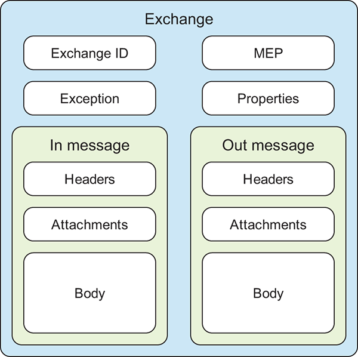

- Exchange ID—A unique ID that identifies the exchange. Camel automatically generates the unique ID.

- MEP—A pattern that denotes whether you’re using the InOnly or InOut messaging style. When the pattern is InOnly, the exchange contains an in message. For InOut, an out message also exists that contains the reply message for the caller.

- Exception—If an error occurs at any time during routing, an Exception will be set in the exception field.
- Properties—Similar to message headers, but they last for the duration of the entire exchange. Properties are used to contain global-level information, whereas message headers are specific to a particular message. Camel itself adds various properties to the exchange during routing. You, as a developer, can store and retrieve properties at any point during the lifetime of an exchange.
- In message—This is the input message, which is mandatory. The in message contains the request message.
- Out message—This is an optional message that exists only if the MEP is InOut. The out message contains the reply message.

The exchange is the same for the entire lifecycle of routing, but the messages can change, for instance, if messages are transformed from one format to another.

## Camels Architecture

A high level view of Camels architecture:

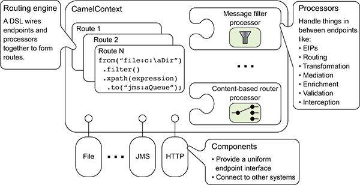

## Camel Concepts

###### Camel Context

Camels runtime system holding all of the pieces together.

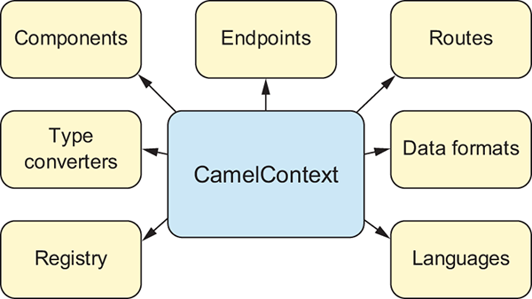

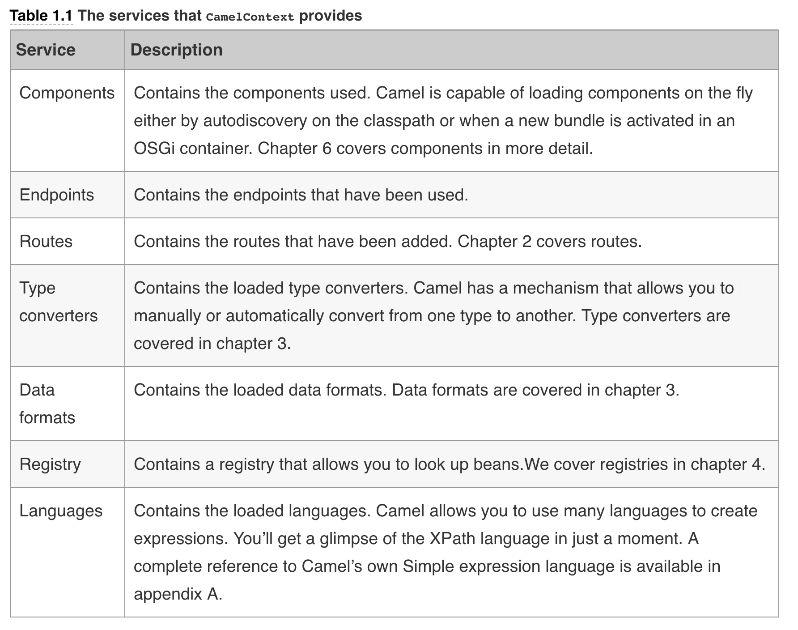

###### Routing Engine

This is what moves the messages - Thsi is not exposed to the developer but you should be a ware that it is there.

###### Routes

The simplest way to define a route is a chain of processors. Using routes de-couples clients form servers and producers form consumers allowing many advantages such as:

- Being able to decide dynamically which server a client will invoke.
- Provides a flexible way to add extra processing.
- Alloes for clients and servers ot be developed independently.
- Promotes better design practices
- Enhance features and functionality of some systems.
- Allows components to be stubbed for testing.

Each route in camel has a UID. Routes are also tied to exactly one endpoint. There is some syntactic sugar allowing us to define multiple senders for a single receiver.

	from("jms:queue:A", "jms:queue:B", "jms:queue:C").to("jms:queue:D");
	
Under the hood this is actually defining three separate routes.

	from("jms:queue:A").to("jms:queue:D");
	from("jms:queue:B").to("jms:queue:D");
	from("jms:queue:C").to("jms:queue:D");
	
	
Even though it’s perfectly legal in Camel 2.x, we don’t recommend using multiple inputs per route. This ability will be removed in the next major version of Camel. To define these routes, we use a DSL.

###### Processors

A core Camel concept that reperesents a node capapble of using, creating or modifying an incoming exchange.

During routing, exchangesflow from one processor to another.

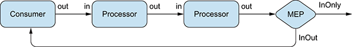

Notice that routes start with a consumer - this is counterf intuitive when compared with other messaging systems - Think of a consumer as receiving from external systems and producer as producing to external systems.

As the message is passe down the pipeline the out message of the previous process is used as the in messge to the next - In some cases a n out message isn't produced, in this case the in message is used as the output - as it was received.

###### Components

The main extension point in Camel. the Camel Eco system has over 280 components and you can also create your own components.

From a programming point of view, components are fairly simple: they’re associated with a name that’s used in a URI, and they act as a factory of endpoints. For example, FileComponent is referred to by file in a URI, and it creates FileEndpoints. The endpoint is perhaps an even more fundamental concept in Camel.

###### Endpoint

Models the end of a channel through which a system can receive / send message.

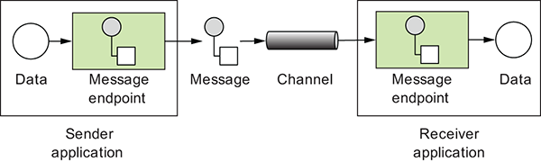

We can configure endpoints by using URI's, such as `file:data/inbox?delay=5000`
At runtime camel looks up an endpoint based on the URI notation.

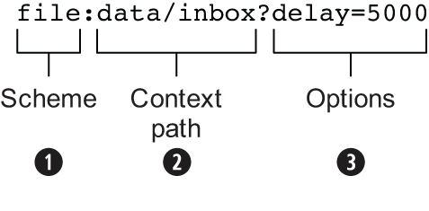

The scheme ❶ denotes which Camel component handles that type of endpoint. In this case, the scheme of file selects FileComponent. FileComponent then works as a factory, creating FileEndpoint based on the remaining parts of the URI. The context path data/inbox ❷ tells FileComponent that the starting folder is data/inbox. The option, delay=5000 ❸ indicates that files should be polled at a 5-second interval.

There’s more to an endpoint than meets the eye. Figure 1.13 shows how an endpoint works together with an exchange, producers, and consumers. At first glance, figure 1.13 may seem a bit overwhelming, but it will all make sense in a few minutes. In a nutshell, an endpoint acts as a factory for creating consumers and producers that are capable of receiving and sending messages to a particular endpoint. We didn’t mention producers or consumers in the high-level view of Camel in figure 1.8, but they’re important concepts.

###### Producers

A producer is the Camel abstraction that refers to an entity capable of sending a message to an endpoint. Figure 1.13 illustrates where the producer fits in with other Camel concepts.

When a message is sent to an endpoint, the producer handles the details of getting the message data compatible with that particular endpoint. For example, FileProducer will write the message body to a file. JmsProducer, on the other hand, will map the Camel message to javax.jms.Message before sending it to a JMS destination. This is an important feature in Camel, because it hides the complexity of interacting with particular transports. All you need to do is route a message to an endpoint, and the producer does the heavy lifting.

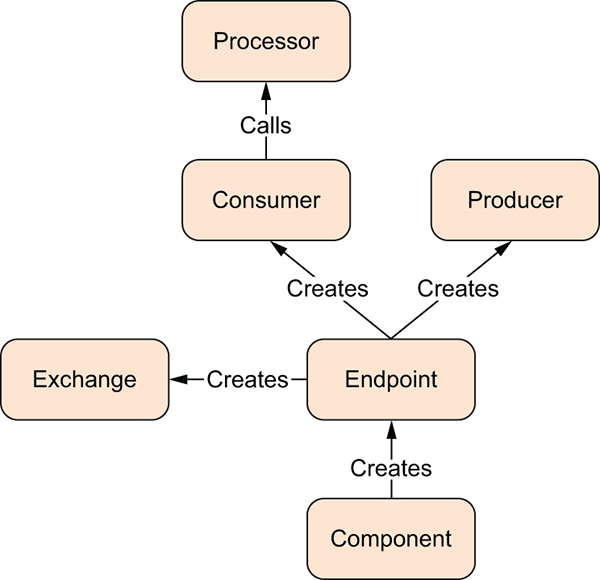

###### Consumers

A consumer is the service that receives messages produced by some external system, wraps them in an exchange, and sends them to be processed. Consumers are the source of the exchanges being routed in Camel.

Looking back at figure 1.13, you can see where the consumer fits in with other Camel concepts. To create a new exchange, a consumer will use the endpoint that wraps the payload being consumed. A processor is then used to initiate the routing of the exchange in Camel via the routing engine.

Camel has two kinds of consumers: event-driven consumers and polling consumers. The differences between these consumers are important, because they help solve different problems.

###### Event Driven Consumer

This kind of consumer is mostly associated with client-server architectures and web services. It’s also referred to as an asynchronous receiver in the EIP world. An event-driven consumer listens on a particular messaging channel, such as a TCP/IP port, JMS queue, Twitter handle, Amazon SQS queue, WebSocket, and so on. It then waits for a client to send messages to it. When a message arrives, the consumer wakes up and takes the message for processing.

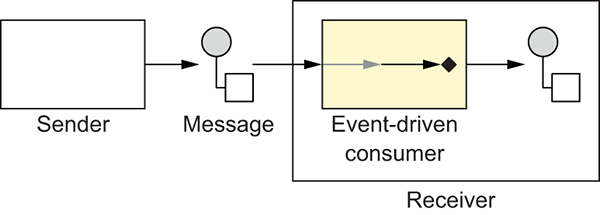

###### Polling Consumer

In contrast to the event-driven consumer, the polling consumer actively goes and fetches messages from a particular source, such as an FTP server. The polling consumer is also known as a synchronous receiver in EIP lingo, because it won’t poll for more messages until it’s finished processing the current message. A common flavor of the polling consumer is the scheduled polling consumer, which polls at scheduled intervals. File, FTP, and email components all use scheduled polling consumers.

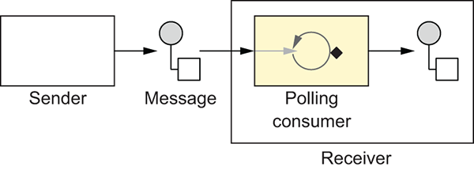

## A Simple Example
The below is a simple example that copies files from inbox/ to outbox/. This 
	package camelinaction;
	
	import org.apache.camel.CamelContext;
	import org.apache.camel.builder.RouteBuilder;
	import org.apache.camel.impl.DefaultCamelContext;
	
	public class FileCopierWithCamel {
	
	    public static void main(String args[]) throws Exception {
	        // create CamelContext
	        CamelContext context = new DefaultCamelContext();
	
	        // add our route to the CamelContext
	        context.addRoutes(new RouteBuilder() {
	            public void configure() {
	                from("file:data/inbox?noop=true").to("file:data/outbox");
	            }
	        });
	
	        // start the route and let it do its work
	        context.start();
	        Thread.sleep(10000);
	
	        // stop the CamelContext
	        context.stop();
	    }
	
	}
	
	
	
In this example, you first create CamelContext, which is the Camel runtime. You then add the routing logic by using RouteBuilder and the Java DSL ❶. By using the DSL, you can cleanly and concisely let Camel instantiate components, endpoints, consumers, producers, and so on. All you have to focus on is defining the routes that matter for your integration projects. Under the hood, though, Camel is accessing the FileComponent, and using it as a factory to create the endpoint and its producer. The same FileComponent is used to create the consumer side as well.

The call to Thread.sleep() is not always needded in production. This example is to demonstrate the mechanics of the low-level Camel API. Thsi is not required anyway when a Camel app is deployed to another container/runtime. Even if this is a standalone route there is. abetter way provided by Camel - `org.apache.camel.main.Main`

## Routing with Camel

Routing is th eprocess by ehich a message is taken from an input queue and routed to an output queue. This is done via the messsage router such that the logic is decoupled form the message consumer/producer.

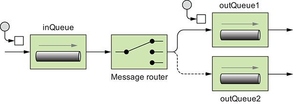

#### Creating Routes in Java

In chapter 1, you saw that RouteBuilder can be used to create a route and that each CamelContext can contain multiple routes. It may not have been obvious, though, that RouteBuilder isn’t the final route that CamelContext will use at runtime; it’s a builder of one or more routes, which are then added to CamelContext. This is illustrated in figure 2.5.

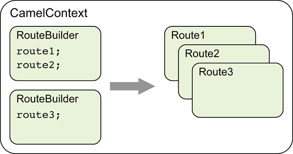

IMPORTANT  This distinction between RouteBuilder and routes is an important one. The DSL code you write in RouteBuilder, whether that’s with the Java or XML DSL, is merely a design-time construct that Camel uses once at startup. So, for instance, the routes that are constructed from RouteBuilder are the things that you can debug with your IDE. We cover more about debugging Camel applications in chapter 8.

#### Using Route Builder

The abstract org.apache.camel.builder.RouteBuilder class in Camel is one that you’ll see frequently. You need to use it anytime you create a route in Java.

To use the RouteBuilder class, you extend a class from it and implement the configure method, like this:

	public class MyRouteBuilder extends RouteBuilder {
	    public void configure() throws Exception {
	        ...
	    }
	}

You then need to add the class to CamelContext with the addRoutes method:

	CamelContext context = new DefaultCamelContext();
	context.addRoutes(new MyRouteBuilder());

Alternatively, you can combine the RouteBuilder and CamelContext configuration by adding an anonymous RouteBuilder class directly into CamelContext, like this:

	CamelContext context = new DefaultCamelContext();
	context.addRoutes(new RouteBuilder() {
	    public void configure() throws Exception {
	        ...
	    }
	});
	
Within the configure method, you define your routes by using the Java DSL

NOTE  For more information on internal DSLs, see Martin Fowler’s “Domain Specific Language” entry on his bliki (blog plus wiki) at www.martinfowler.com/bliki/DomainSpecificLanguage.html. He also has an entry on “Fluent Interfaces” at www.martinfowler.com/bliki/FluentInterface.html. For more information on DSLs in general, we recommend DSLs in Action by Debasish Ghosh (Manning, 2010).

### Dynamic Endpoints

We can decide which endpoints to send to at runtime using dynamic endpoints. This is done using `.toD("jms:queue:${header.myDest}")` 

### Using Property Placeholders

We can also define placeholders for the dynamic parts of the URL. 

To so this with the JAva DSL we use the Properties component.

TIP  You can use the Jasypt component to encrypt sensitive information in the properties file. For example, you may not want to have passwords in clear text in the properties file. You can read more about the Jasypt component in chapter 14.

	CamelContext context = new DefaultCamelContext();        
	PropertiesComponent prop = camelContext.getComponent(     
	    "properties", PropertiesComponent.class);             
	prop.setLocation("classpath:rider-test.properties"); 

Then to define the actual property we put a line in `rider-test.properties`:

	myDest=incomingOrders 

Then we can use thsi in RouteBuilder:

	return new RouteBuilder() {
	    @Override
	    public void configure() throws Exception {
	        from("file:src/data?noop=true")
	            .to("jms:{{myDest}}");                                             
	        from("jms:incomingOrders")
	            .to("mock:incomingOrders");                
	    }
	};
	
You should notice that the Camel syntax for property placeholders is a bit different than for Spring property placeholders. The Camel Properties component uses the {{key}} syntax, whereas Spring uses ${key}.

###### The Camel Properties component vs. Spring property placeholders

The Camel Properties component is more powerful than the Spring property placeholder mechanism. The latter works only when defining routes using Spring XML, and you have to declare the endpoints in dedicated <endpoint> tags for the property placeholders to work.

The Camel Properties component is provided out of the box, which means you can use it without using Spring at all. And it supports the various DSL languages you can use to define routes, such as Java, Spring XML, and Blueprint OSGi XML. On top of that, you can declare the placeholders anywhere in the route definitions. 

Compare Spring to Spring Boot here !!

#### Referencing Registry Beans in Endpoint URI's 

Lets say we need a filter for our FTP site to fetch only .csv files that contain orders,

We could define:

	public class OrderFileFilter<T> implements GenericFileFilter<T> {
	     public boolean accept(GenericFile<T> file) {
	        return file.getFileName().endsWith("csv");
	    }
	}
	
Then add to the registry:

	registry.bind("myFilter", new OrderFileFilter<Object>());
	
	
Now we use `#` to refer to the named instance in the registry.

	from("ftp://rider.com/orders?username=rider&password=secret&filter=#myFilter")

## My first EIP - The Content Based Router.

The name is indicative of the function - pretty much does what it says on the tin - When we refer to content this could be content in the headers or part of the payload - or anything else in the message exchange.

Now imagine we have two types of order - .csv and .xml. We. want to process each differently, so we could use th efile extension to do this .

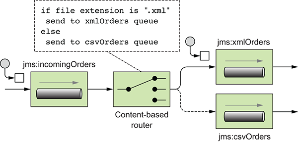

To perform this routing we are introduced to a few keywords:

`choice()` - Creates a CBR processor.
`when()` - Used after `choice()` with a predicate to determine the condition of delivery.

Camel’s creators could have chosen contentBasedRouter for the method name, to match the EIP, but they stuck with choice because it reads more naturally. It looks like this:

	from("jms:incomingOrders")
	    .choice()
	        .when(predicate)
	            .to("jms:xmlOrders")
	        .when(predicate)
	            .to("jms:csvOrders");

The predicate in Camel is a simple interface:

	
	public interface Predicate {
	    boolean matches(Exchange exchange);
	}

This is not always required because we can just inline this logic:

        return new RouteBuilder() {
            @Override
            public void configure() throws Exception {
                // load file orders from src/data into the JMS queue
                from("file:src/data?noop=true").to("jms:incomingOrders");
        
                // content-based router
                from("jms:incomingOrders")
                    .choice()
                        .when(simple("${header.CamelFileName} ends with 'xml'"))
                            .to("jms:xmlOrders")  
                        .when(simple("${header.CamelFileName} ends with 'csv'"))
                            .to("jms:csvOrders");
                
                // test that our route is working
                from("jms:xmlOrders")
                    .log("Received XML order: ${header.CamelFileName}")
                    .to("mock:xml");                
                
                from("jms:csvOrders")
                    .log("Received CSV order: ${header.CamelFileName}")
                    .to("mock:csv");
            }
        };

Notice DSL method `log` used here to log output to the console.

Also not the use of `ends with` from the simple expression language - Appendix A of Camel In Action is devoted to this Simple language as it is so useful when writing Camel Programs.

One customer uploads a .csl so we could extend the above example to handle .csl files using a regex:

	from("jms:incomingOrders")
	    .choice()
	        .when(header("CamelFileName").endsWith(".xml"))
	            .to("jms:xmlOrders")
	        .when(header("CamelFileName").regex("^.*(csv|csl)$"))
	            .to("jms:csvOrders");

This fixes this instan e but does nto handle any other cases ie:. .csj .cas ..... To handle this we can use `otherwise()`:

	from("jms:incomingOrders")
	    .choice()
	        .when(header("CamelFileName").endsWith(".xml"))
	            .to("jms:xmlOrders")
	        .when(header("CamelFileName").regex("^.*(csv|csl)$"))
	            .to("jms:csvOrders")
	        .otherwise()
	            .to("jms:badOrders");
	            
	            
#### Routing after a CBR

There are several ways to contiune processin after a CBR. One is by using another route. Another is by closing the `choice()` block and adding another processing point to the pipeline.

	
	from("jms:incomingOrders")
	    .choice()
	        .when(header("CamelFileName").endsWith(".xml"))
	            .to("jms:xmlOrders")
	        .when(header("CamelFileName").regex("^.*(csv|csl)$"))
	            .to("jms:csvOrders")
	        .otherwise()
	            .to("jms:badOrders")
	    .end()
	    .to("jms:continuedProcessing");

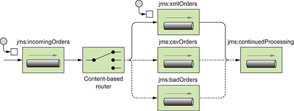

If we wanted to stop the `badOrders` from going any further we could do:

	
	from("jms:incomingOrders")
	    .choice()
	        .when(header("CamelFileName").endsWith(".xml"))
	            .to("jms:xmlOrders")
	        .when(header("CamelFileName").regex("^.*(csv|csl)$"))
	            .to("jms:csvOrders")
	        .otherwise()
	            .to("jms:badOrders").stop()
	    .end()
	    .to("jms:continuedProcessing");

We may also wish to filter out test orders - This can be done using an XPath Expression which are useful for creating conditions based on XML payloads. In this case, the expression will evaluate to true for orders that don’t have the test attribute.

So message:
	
	<?xml version="1.0" encoding="UTF-8"?>
	<order name="motor" amount="1" customer="foo" test="true"/>
	
Would be filtered out by :

	from("jms:xmlOrders")
	     .filter(xpath("/order[not(@test)]"))
	     .log("Received XML order: ${header.CamelFileName}")
	     .to("mock:xml");
	     

## EIP #2 - MultiCast.

As in Networking a MultiCast delivers the same message to many consumers.Using hte Java DSL we can do:

	from("jms:xmlOrders").multicast().to("jms:accounting", "jms:production");

By default the messages are sent to each queue sequentially - First to accounting then to production.

If we want to send these message in parallel - we can do:

	from("jms:xmlOrders")
	    .multicast().parallelProcessing()
	    .to("jms:accounting", "jms:production");
	    
	    
This sets up the multicast to distribute messages to the destinations in parallel. Under the hood, a thread pool is used to manage threads. This can be replaced or configured as you see fit. For more information on the Camel threading model and thread pools, see chapter 13.

Our multicast is working but we have no way to recover from exceptions - To stop processing at the first exception thrown:

	from("jms:xmlOrders")
	    .multicast()
	        .stopOnException()
	        .to("direct:accounting", "direct:production")
	    .end()
	    .to("mock:end");
	   
	from("direct:accounting")        
	    .throwException(Exception.class, "I failed!")
	    .log("Accounting received order: ${header.CamelFileName}")
	    .to("mock:accounting");                
	
	from("direct:production")        
	    .log("Production received order: ${header.CamelFileName}")
	    .to("mock:production"); 
	    

To handle the exception coming back from this route, you’ll need to use Camel’s error-handling facilities, which are described in detail in chapter 11.

**TIP :**  Take care when using stopOnException with asynchronous messaging. In our example, the exception could have happened after the message had been consumed by both the accounting and production queues, nullifying the stopOnException effect. In our test case, we decided to use synchronous direct endpoints, which would allow us to test this feature of the multicast.

## EIP #3 - The Recipient List

We decider that we need top parallelize only our VIP customers orders - Paraleleizing asll is bogging down production.

To do this we use the Recipient List EIP.

A Recipient List first inspects incoming messages, then generates a of desired recipients based on the message content, and sends the message to those recipients. A recipient is specified by an endpoint URI. Note that the recipient list is different from the multicast because the list of recipients is dynamic.

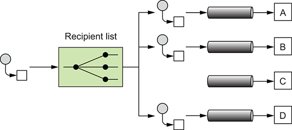

This can be implemented in the Java DSL using;

	from("jms:xmlOrders")
	    .recipientList(header("recipients"));

This is useful if you already have some information in the message that can be used to construct the destination names—you could use an expression to create the list. In order for the recipient list to extract meaningful endpoint URIs, the expression result must be iterable. Values that will work are java.util.Collection, java.util.Iterator, java.util.Iterable, Java arrays, org.w3c.dom.NodeList, and, as shown in the example, a String with comma-separated values.

I our example th emessage does not contain that list - the list is determined by th elevel of hte customer - A simple solutiuon would be to use a BEan - ie: 

	from("jms:xmlOrders")
	    .setHeader("recipients", method(RecipientsBean.class, "recipients"))
	    .recipientList(header("recipients"));
	    
The BEan we will use is defined as:

	public class RecipientsBean {
	    public String[] recipients(@XPath("/order/@customer") String customer) {
	        if (isGoldCustomer(customer)) {
	            return new String[]{"jms:accounting", "jms:production"};
	        } else {
	            return new String[]{"jms:accounting"};
	        }
	    }
	
	    private boolean isGoldCustomer(String customer) {
	        return customer.equals("honda");
	    }
	}

The RecipientsBean class returns "jms:accounting, jms:production" only if the customer is at the gold level of support. The check for gold-level support here is greatly simplified; ideally, you’d query a database for this check. Any other orders will be routed only to accounting, which will send them to production after the checks are complete.

##### Recipient List Annotation.

Rather than using the recipientList method in the DSL, you can add a @RecipientList annotation to a method in a plain Java class (a Java bean). This annotation tells Camel that the annotated method should be used to generate the list of recipients from the exchange. This behavior gets invoked, however, only if the class is used with Camel’s bean integration.

For example, replacing the custom bean you used in the previous section with an annotated bean results in a greatly simplified route:

	from("jms:xmlOrders").bean(AnnotatedRecipientList.class);

Now all the logic for calculating the recipients and sending out messages is captured in the AnnotatedRecipientList class, which looks like this:

	public class AnnotatedRecipientList {
	    @RecipientList
	    public String[] route(@XPath("/order/@customer") String customer) {
	        if (isGoldCustomer(customer)) {
	            return new String[]{"jms:accounting", "jms:production"};
	        } else {
	            return new String[]{"jms:accounting"};
	        }
	    }
	
	    private boolean isGoldCustomer(String customer) {
	        return customer.equals("honda");
	    }
	}

Notice that the return type of the bean is a list of the desired recipients. Camel will take this list and send a copy of the message to each destination in the list.

##### Using the Wiretap Method

By using the wireTap method in the Java DSL, you can send a copy of the exchange to a secondary destination without affecting the behavior of the rest of the route:

	from("jms:incomingOrders")
	    .wireTap("jms:orderAudit")
	    .choice()
	        .when(header("CamelFileName").endsWith(".xml"))
	            .to("jms:xmlOrders")
	        .when(header("CamelFileName").regex("^.*(csv|csl)$"))
	            .to("jms:csvOrders")
	        .otherwise()
	            .to("jms:badOrders");
	            
The preceding code sends a copy of the exchange to the orderAudit queue, and the original exchange continues on through the route, as if you hadn’t used a wire tap at all. Camel doesn’t wait for a response from the wire tap because the wire tap sets the message exchange pattern (MEP) to InOnly. The message will be sent to the orderAudit queue in a fire-and-forget fashion—it won’t wait for a reply.

What can you do with a tapped message? Numerous things could be done at this point:

You could print the information to the console as you did before. This is useful for simple debugging purposes.
You could save the message in a persistent store (in a file or database) for retrieval later.
The wire tap is a useful monitoring tool, but it leaves most of the work up to you. We’ll discuss some of Camel’s more powerful tracing and auditing tools in chapter 16.

### Key Concepts from Chapter 2

- Routing occurs in many aspects of everyday life—Whether you’re surfing the internet, doing online banking, or booking a flight or hotel room, messages are being routed behind the scenes via some sort of router.

- Use Apache Camel for routing messages—Camel is primarily a message router that allows you to route messages from and to a variety of transports and APIs.

- Camel’s DSLs are used to define routing rules—The Java DSL allows you to write in the popular Java language, which gives you autocompletion of terms in most IDEs. It also allows you to use the full power of the Java language when writing routes. It’s considered the main DSL in Camel. The XML DSL allows you to write routing rules without any Java code at all.

- The Java DSL and Spring CamelContext are a powerful combination—Section 2.4.3 described our favorite way to write Camel applications, which is to boot up CamelContext in Spring and write routing rules in Java DSL RouteBuilders. This gives you the best of both: the most expressive DSL that Camel has in the Java DSL, and a more feature-rich and standard container in the Spring CamelContext.

- Use enterprise integration patterns (EIPs) to solve integration and routing problems—EIPs are like design patterns from object-oriented programming, but for the enterprise integration world.

- Use Camel’s built-in EIP implementations rather than creating your own—Camel implements most EIPs as easy-to-use DSL terms, which allows you to focus on the business problem rather than the integration architecture.

The coming chapters build on this foundation to show you things like data transformation, using beans, using more advanced EIPs, sending data over other transports, and more. In the next chapter, you’ll look at how Camel makes data transformation a breeze.

## Transforming Data With Camel

Data Transformation in CAmel covers 2 tyoes of transformation:

- Data format transformation - The data format of the message body is transformaed from ne form to anohter. For example, a CSV record is formatted as XML.

- Data type transformation - The data type of hte message body is transformed form one type to another.

In most cases, the data transformation you’ll face with Camel is format transformation: you have to mediate between two protocols. Camel has a built-in type-converter mechanism that can automatically convert between types, which greatly reduces the need for end users to deal with type transformations.

 In Camel, data transformation typically takes place in the six ways listed in table 3.1.
 
 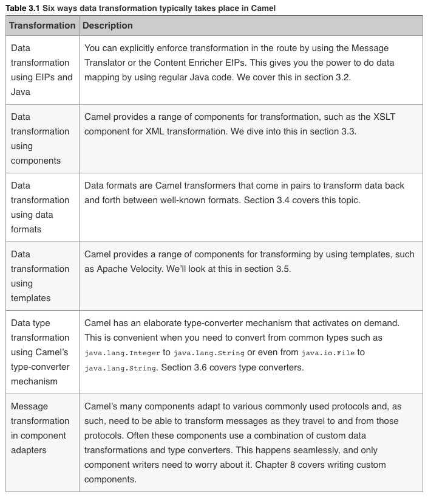
 
 
## Data Transforamtion using EIP's and Java.

 In this section, you’ll look at mapping data by using Processor, a Camel API. Camel can also use Java beans for mapping, which is a good practice because it allows your mapping logic to be independent of the Camel API.
 
## EIP #4 -  The Message Translator.
 
 This is the EIP equivalent of the Adapter Pattern from Object Oriented Design Patterns books. (ie: Gang Of Four). We can use thsi pattern in 3 different ways:
 
 
 - Using `Processor`
 - Using Java Beans
 - Using `<transform>`

 
#### Using Processor to transform
 
 The Camel Processor is an interface defined in org.apache.camel.Processor with a single method:
 
	 public void process(Exchange exchange) throws Exception;

`Processor` is a low-level API in which you work directly on the Camel `Exchange` instance.It gives you full access to all odf CAmels moving parts from the `CamelContext`, which can be obtained from the `Exchange` by using the `getContext()` method.

Let’s look at an example. At Rider Auto Parts, you’ve been asked to generate daily reports of newly received orders to be outputted to a CSV file. The company uses a custom format for order entries, but to make things easy, they already have an HTTP service that returns a list of orders for whatever date you input. The challenge you face is mapping the returned data from the HTTP service to a CSV format and writing the report to a file.

To Define a Camel Processor:

	package camelinaction;
	
	import org.apache.camel.Exchange;
	import org.apache.camel.Processor;
	
	/**
	 * A processor which translates an order in custom inhouse format
	 * to a CSV format
	 */
	public class OrderToCsvProcessor implements Processor {
	
	    public void process(Exchange exchange) throws Exception {
	        String custom = exchange.getIn().getBody(String.class);
	
	        String id = custom.substring(0, 10);
	        String customerId = custom.substring(10, 20);
	        String date = custom.substring(20, 30);
	        String items = custom.substring(30);
	        String[] itemIds = items.split("@");
	
	        StringBuilder csv = new StringBuilder();
	        csv.append(id.trim());
	        csv.append(",").append(date.trim());
	        csv.append(",").append(customerId.trim());
	        for (String item : itemIds) {
	            csv.append(",").append(item.trim());
	        }
	
	        exchange.getIn().setBody(csv.toString());
	    }
	
	}
	
#### ASIDE - Using getIn() and getOut()

The Camel Exchange defines two methods for retrieving messages: getIn and getOut. The getIn method returns the incoming message, and the getOut method accesses the outbound message.

In two scenarios, the Camel end user will have to decide which method to use:

- A read-only scenario, such as when you’re logging the incoming message.
- A write scenario, such as when you’re transforming the message.

In the second scenario, you’d assume getOut should be used. That’s correct according to theory, but in practice there’s a common pitfall when using getOut: the incoming message headers and attachments will be lost. This is often not what you want, so you must copy the headers and attachments from the incoming message to the outgoing message, which can be tedious. The alternative is to set the changes directly on the incoming message by using getIn, and not to use getOut at all. This is the practice we use most often in this book.

#### Back to - Using Processor to transform
To use this `Processor`:

	from("quartz2://report?cron=0+0+6+*+*+?")
	    .to("http://riders.com/orders/cmd=received&date=yesterday")
	    .process(new OrderToCsvProcessor())
	    .to("file://riders/orders?fileName=report-${header.Date}.csv");
	    

The preceding route uses Quartz to schedule a job to run once a day at 6 a.m. It then invokes the HTTP service to retrieve the orders received yesterday, which are returned in the custom format. Next, it uses OrderToCsvProcessor to map from the custom format to CSV format before writing the result to a file.

Using a processor has one disadvantage: you’re required to use the Camel API. In the next section, you’ll learn how to avoid this by using a bean.

#### Using Beans to transform.	

We can define the same processor without being reliant upon th eCamlel API - Instead we use Java Beans.

	package camelinaction;
	
	/**
	 * A bean which translates an order in custom inhouse format
	 * to a CSV format.
	 */
	public class OrderToCsvBean {
	
	    public String map(String custom) {
	        String id = custom.substring(0, 10);
	        String customerId = custom.substring(10, 20);
	        String date = custom.substring(20, 30);
	        String items = custom.substring(30);
	        String[] itemIds = items.split("@");
	
	        StringBuilder csv = new StringBuilder();
	        csv.append(id.trim());
	        csv.append(",").append(date.trim());
	        csv.append(",").append(customerId.trim());
	        for (String item : itemIds) {
	            csv.append(",").append(item.trim());
	        }
	
	        return csv.toString();
	    }
	
	}

Using beans is a great practice because it allows you to use any Java code and library you wish. Camel imposes no restrictions whatsoever. Camel can invoke any bean you choose, so you can use existing beans without having to rewrite or recompile them.

TO re-write the route to use the BEamn instead of the processor we can do:

	from("quartz2://report?cron=0+0+6+*+*+?")
	    .to("http://riders.com/orders/cmd=received&date=yesterday")
	    .bean(new OrderToCsvBean())
	    .to("file://riders/orders?fileName=report-${header.Date}.csv");
	    

Another advantage of using beans over processors for mappings is that unit testing is much easier. For example, listing 3.2 doesn’t require the use of Camel at all, as opposed to listing 3.1, where you need to create and pass in an Exchange instance.

We’ll leave the beans for now, because they’re covered extensively in the next chapter. But you should keep in mind that beans are useful for doing message transformation.

#### Using the Java DSL Transform command to transform

`transform` is a method int hte Java DSL that can be used in CAmel routes to transform messages.By allowing the use of expressions, transform permits great flexibility, and using expressions directly within the DSL can sometimes save time. Let’s look at a little example.

Suppose you need to prepare text for HTML formatting by replacing all line breaks with a   tag. You can do this with a built-in Camel expression that searches and replaces using regular expressions:

	from("direct:start")
	    .transform(body().regexReplaceAll("\n", " "))
	    .to("mock:result");

What this route does is use the transform method to tell Camel that the message should be transformed using an expression. Camel provides the Builder pattern to build compound expressions from individual expressions. This is done by chaining together method calls, which is the essence of the Builder pattern.

#### ASIDE - The Direct Component

The example here uses the Direct component (http://camel.apache.org/direct) as the input source for the route (from("direct:start")). The Direct component provides direct invocation between a producer and a consumer. It allows connectivity only from within Camel, so external systems can’t send messages directly to it. This component is used within Camel to do things such as link routes together or for testing.

For more information on the Direct component and other types of in-memory messaging, see chapter 6.

Camel also allows us to use custom expressions - So the previous example could be implemented as:

	from("direct:start")
	    .transform(new Expression() {
	        public <T> T evaluate(Exchange exchange, Class<T> type) {
	            String body = exchange.getIn().getBody(String.class);
	            body = body.replaceAll("\n", " ");
	            body = "<body>" + body + "</body>";
	            return (T) body;
	        }
	    })
	    .to("mock:result");

## EIP #5 - The Content Enricher

The Content Enricher EIP is illustrated in figure 3.3. This pattern documents the scenario in which a message is enriched with data obtained from another resource.

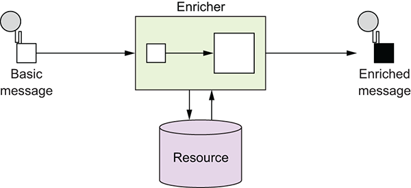

To help understand this pattern, let’s turn back to Rider Auto Parts. It turns out that the data mapping you did in listing 3.1 wasn’t sufficient. Orders are also piled up on an FTP server, and your job is to somehow merge this information into the existing report. Figure 3.4 illustrates the scenario.

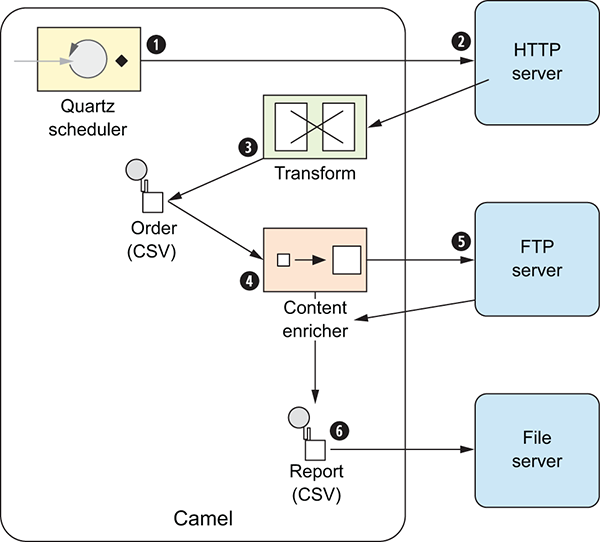

Before you dig into the code and see how to implement this, you need to take a step back and look at how the Content Enricher EIP is implemented in Camel. Camel provides two methods in the DSL for implementing the pattern:

- `pollEnrich()` — This method merges data retrieved from another source by using a consumer.
- `enrich()` — This method merges data retrieved from another source by using a producer.

The difference between pollEnrich and enrich
The difference between pollEnrich and enrich is that the former uses a consumer, and the latter uses a producer, to retrieve data from the source. Knowing the difference is important: the file component can be used with both, but using enrich will write the message content as a file; using pollEnrich will read the file as the source, which is most likely the scenario you’ll be facing when enriching with files. The HTTP component works only with enrich; it allows you to invoke an external HTTP service and use its reply as the source.

Camel uses the org.apache.camel.processor.aggregate.AggregationStrategy interface to merge the result from the source with the original message, as follows:

`Exchange aggregate(Exchange oldExchange, Exchange newExchange);`

This aggregate method is a callback that you must implement. The method has two parameters: the first, named oldExchange, contains the original exchange; the second, newExchange, is the enriched source. Your task is to enrich the message by using Java code and return the merged result. Let's see this in action.

To solve the problem at Rider Auto Parts, you need to use pollEnrich because it’s capable of polling a file from an FTP server.

### Transforming XML

We dont use XML anymore so not really looked at this but should be aware that we can use XSLT, Xstream and JaxB along with Camel to perform transformations on XML.

### Transforming with data formats

In Camel, data formats are pluggable transformers that can transform messages from one form to another, and vice versa. Each data format is represented in Camel as an interface in org.apache.camel.spi.DataFormat containing two methods:

- marshal — For marshaling a message into another form, such as marshaling Java objects to XML, CSV, JSON, HL7, or other well-known data models

- unmarshal — For performing the reverse operation, which turns data from well-known formats back into a message.

You may already have realized that these two functions are opposites; one is capable of reversing what the other has done, as illustrated in figure 3.6.

## Data formats provided with Camel

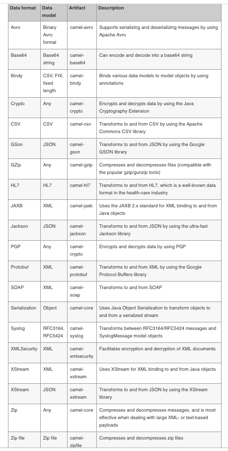

Camel provides more than 40 data formats out of the box. You can read more about these data formats at the Camel website (http://camel.apache.org/data-format.html). We’ve picked three to cover in the following section. They’re among the most commonly used, and what you learn about those will also apply to the remainder of the data formats.

The book includes info on CSV,JSON,XML, and Bindy.

## Using Velocity for templating

Camel provides slick integration with two template languages:

Apache Velocity—Probably the best-known templating language (http://camel.apache.org/velocity.html)

Apache FreeMarker—Another great templating language from Apache (http://camel.apache.org/freemarker.html)

These two templating languages are fairly similar to use, so we discuss only Velocity here.

Rider Auto Parts has implemented a new order system that must send an email reply when a customer has submitted an order. Your job is to implement this feature.

The reply email could look like this:

	Dear customer
	Thank you for ordering X piece(s) of XXX at a cost of XXX.
	This is an automated email, please do not reply.

Three pieces of information in the email must be replaced at runtime with real values. You need to adjust the email to use the Velocity template language, and then place it into the source repository as src/test/resources/email.vm:

	Dear customer
	Thank you for ordering ${body.amount} piece(s) of ${body.name} at a cost of ${body.price}.
	This is an automated email, please do not reply.

Notice that you insert ${ } placeholders in the template, which instructs Velocity to evaluate and replace them at runtime. Camel prepopulates the Velocity context with numerous entities that are then available to Velocity. Those entities are listed in table 3.6.

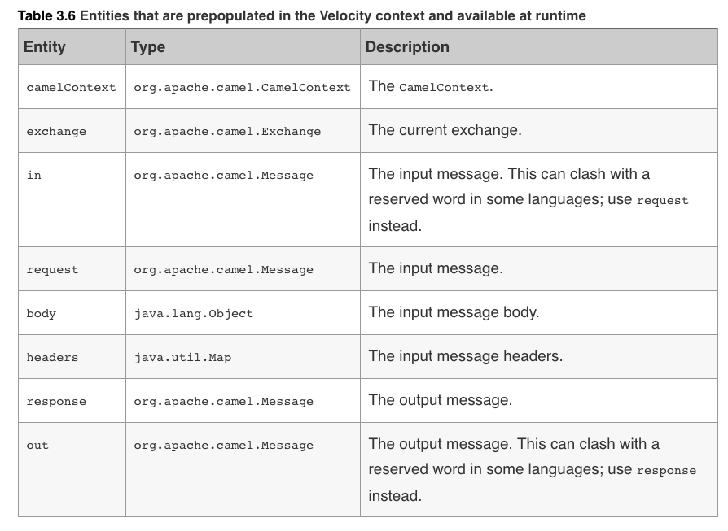

To use Velocity in a route:
	
	from("direct:sendMail")
	    .setHeader("Subject", constant("Thanks for ordering"))
	    .setHeader("From", constant("donotreply@riders.com"))
	    .to("velocity://rider/mail.vm")
	    .to("smtp://mail.riders.com?user=camel&password=secret");
	    
	    
## Understanding Camel type converters

Camel provides a buitlt in type converter system that automatically convetts between well known types. this system allows Camel components to easily work together without having type mismatches. And from th eCamel users perspective type conversions are built in to the API without being invasive.

For Example:

`String custom = exchange.getIn().getBody(String.class);`

The getBody method is passed the type you want to have returned. Under the covers, the type-converter system converts the returned type to a String if needed.

TypeConverterRegistry is where all the type converters are registered when Camel is started. At runtime, Camel uses the TypeConverterRegistry’s lookup method to look up a suitable TypeConverter:

	TypeConverter lookup(Class<?> toType, Class<?> fromType);

By using TypeConverter, Camel can then convert one type to another by using TypeConverter’s convertTo method, which is defined as follows:

	<T> T convertTo(Class<T> type, Object value);

**NOTE-**  Camel implements about 350 or more type converters out of the box, which are capable of converting to and from the most commonly used types.

On startup, Camel loads all the type converters into the TypeConverterRegistry by using a classpath-scanning solution. This allows Camel to pick up type converters not only from camel-core, but also from any of the other Camel components, including your Camel applications. You’ll see this in section 3.6.3 when you build your own type converter.

Camel uses org.apache.camel.impl.converter.AnnotationTypeConverterLoader to scan and load the type converters. To avoid scanning zillions of classes, it reads a service discovery file in the META-INF folder: META-INF/services/org/apache/camel/TypeConverter. This is a plain-text file that has a list of fully qualified class names and packages that contain Camel type converters. The special file is needed to avoid scanning every possible JAR and all their packages, which would be time-consuming. This special file tells Camel whether the JAR file contains type converters. For example, the file in camel-cxf contains the following entries:

AnnotationTypeConverterLoader loads those classes that have been annotated with @Converter, and then searches within them for public methods that are annotated with @Converter. Each of those methods is considered a type converter. Yes, the class @Converter annotation is a bit of overkill when we’ve already defined the class name in the TypeConvertertext file. We need this because we can also specify package names, which could include many classes. For example, a package name of org.apache.camel.component.cxf.converter also could have been provided in the TypeConverter text file and would have included CxfConverter and CxfPayloadConverter. Using the fully qualified class name is preferred, though, because Camel loads them more quickly.

This process is best illustrated with an example. The following code is a snippet from the IOConverter class from the camel-core JAR:

	@Converter
	public final class IOConverter {
	    @Converter
	    public static InputStream toInputStream(URL url) throws IOException {
	        return IOHelper.buffered(url.openStream());
	    }
	}
	
Camel will go over each method annotated with @Converter and look at the method signature. The first parameter is the from type, and the return type is the to type. In this example, you have a TypeConverter that can convert from a URL to an InputStream. By doing this, Camel loads all the built-in type converters, including those from the Camel components in use.

## Using Type converters

As we mentioned, the Camel type converters are used throughout Camel, often automatically. But you might want to use them to force a specific type to be used in a route, such as before sending data back to a caller or a JMS destination. Let’s look at how to do that.

Suppose you need to route files to a JMS queue by using javax.jms.TextMessage. To do so, you can convert each file to a String, which forces the JMS component to use TextMessage. This is easy to do in Camel—you use the convertBodyTo method, as shown here:

	from("file://riders/inbox")
	    .convertBodyTo(String.class)
	    .to("jms:queue:inbox");

Another reason for using convertBodyTo is to read files by using a fixed encoding such as UTF-8. This is done by passing in the encoding as the second parameter:

	from("file://riders/inbox")
	    .convertBodyTo(String.class, "UTF-8")
	    .to("jms:queue:inbox");

That’s all there is to using type converters in Camel routes. Before we wrap up this chapter, though, let’s take a look at how to write your own type converter.

**TIP-**  If you have trouble with a route because of the payload or its type, try using .convertBodyTo(String.class) at the start of the route to convert to a String type, which is a well-supported type. If the payload can’t be converted to the desired type, a NoTypeConversionAvailableException exception is thrown.

Wecan also write our own converters - This sis covered in th eBOOK under Chapter 3

## Cahpter 3 - Summary and best practices
Data transformation is the cornerstone of any integration kit; it bridges the gap between various data types and formats. It’s also essential in today’s industry, because more and more disparate systems need to be integrated to support the ever-changing businesses and world we live in.

This chapter covered many of the possibilities Camel offers for data transformation. You learned how to format messages by using EIPs and beans. You also learned that Camel provides special support for transforming XML documents by using XSLT components and XML-capable data formats. Camel provides data formats for well-known data models, which you learned to use, and it even allows you to build your own data formats. We also took a look into the templating world, which can be used to format data in specialized cases, such as generating email bodies. Finally, we looked at how the Camel type-converter mechanism works and learned that it’s used internally to help all the Camel components work together. You learned how to use it in routes and how to write your own converters.

Here are a few key tips you should take away from this chapter:

- Data transformation is often required — Integrating IT systems often requires you to use different data formats when exchanging data. Camel can act as the mediator and has strong support for transforming data in any way possible. Use the various features in Camel to aid with your transformation needs.

- Java is powerful — Using Java code isn’t a worse solution than using a fancy mapping tool. Don’t underestimate the power of the Java language. Even if it takes 50 lines of grunt boilerplate code to get the job done, you have a solution that can easily be maintained by fellow engineers.

- Prefer to use beans over processors — If you’re using Java code for data transformation, you can use beans or processors. Processors are more dependent on the Camel API, whereas beans allow loose coupling. Chapter 4 covers how to use beans.

This chapter, along with chapter 2, covered two crucial features of integration kits: routing and transformation. The next chapter dives into the world of Java beans, and you’ll see how Camel can easily adapt to and use your existing beans. This allows a higher degree of reuse and loose coupling, so you can keep your business and integration logic clean and apart from Camel and other middleware APIs.

## Using Beans with Camel

There are anumber of ways to use Beans with CAmel - Here we will focus on the Easy Way!!

If we have a bean defined:

	public class HelloBean {
	  public String hello(String name) {
	    return "Hello " + name;
	  }
	}
	
and we want to use thsi bean in our Camel program.

	package camelinaction;
	
	import org.apache.camel.builder.RouteBuilder;
	import org.springframework.beans.factory.annotation.Autowired;
	
	/**
	 * Using a bean in the route to invoke HelloBean.
	 */
	public class InvokeWithBeanSpringRoute extends RouteBuilder {
	
	    @Autowired
	    private HelloBean helloBean;
	
	    @Override
	    public void configure() throws Exception {
	        from("direct:hello")
	            .bean(helloBean, "hello");
	    }
	}

The first parameter is the bean to call, and hello is the name of the method to call, which means Camel will invoke the hello method on the bean instance named helloBean.

#### Prefer to specify the method name
If the bean has only a single method, you can omit specifying the method name, and the example can be reduced to this:

    from("direct:hello").bean("helloBean");
In XML DSL, the example looks like this:

    <bean ref="helloBean"/>
Omitting the method name is recommended only when the beans have a single method. When a bean has several methods, Camel has to find the most suitable method to invoke based on a series of factors. You’ll dive into how this works in section 4.4.2. As a rule of thumb, it’s better to specify the method name, which also lets humans who maintain or later have to modify your code understand exactly which method is being invoked.

**TIP-**  In the Java DSL, you don’t have to preregister the bean in the registry. Instead, you can provide the class name of the bean, and Camel will instantiate the bean on startup. The previous example could be written like this: from("direct:hello").bean(HelloBean.class);.

## EIP #6 - The Service Activator Pattern

The Service Activator pattern is an enterprise pattern described in Hohpe and Woolf’s Enterprise Integration Patterns book. It describes a service that can be invoked easily from both messaging and non-messaging services.

This service activator component invokes a service based on an incoming request and returns an outbound reply. The service activator acts as a mediator between the requester and the POJO service. The requester sends a request to the service activator 1, which is responsible for adapting the request to a format the POJO service understands (mediating) and passing the request on to the service 2. The POJO service then returns a reply to the service activator 3, which passes it back (requiring no translation on the way back) to the waiting requester 4.

As you can see in figure 4.1, the service is the POJO, and the service activator is something in Camel that can adapt the request and invoke the service. That something is the Camel Bean component, which eventually uses org.apache.camel.component.bean.BeanProcessor to do the work. You’ll look at how this BeanProcessor works in section 4.4. You should regard the Camel Bean component as the Camel implementation of the Service Activator pattern.

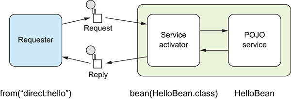

Here you can see how the Camel route maps to the Service Activator EIP. The requester is the node that comes before the bean—it’s the from("direct:hello") in our example. The service activator itself is the bean node, which is represented by the bean component in Camel. And the POJO service is the HelloBean bean itself.

You now know the theory behind how Camel works with beans—the Service Activator pattern. But before you can use a bean, you need to know where to look for it. This is where the registry comes into the picture. Let’s look at how Camel works with various registries.

#### CDI Bean Registry

Contexts and Dependency Injection (CDI) is a Java specification that standardizes how Java developers can integrate Java beans in a loosely coupled way. For Camel developers, it means you can use the CDI annotations to inject Java beans, Camel endpoints, and other services.

CDI is a Java specification that’s part of Java EE, and therefore available in Java EE application servers such as Apache TomEE, WildFly, and in commercial offerings as well. But CDI is lightweight, and you can run in a standalone CDI container such as Apache OpenWebBeans or JBoss Weld. You’ll encounter CDI again in chapters 7, 9, and 15 as you learn about CDI with microservices, testing, and running Camel. CdiBeanRegistry is the default registry when using Camel with CDI. The registry is automatically created in the default constructor of the CdiCamelContext, as shown here:

In CDI, beans can be defined by using CDI annotations.

For example if we have a bean:

	package camelinaction;
	
	import javax.inject.Named;
	import javax.inject.Singleton;
	
	/**
	 * A simple bean to print hello.
	 * 

	 * The bean is named using the CDI annotation @Named
	 */
	@Singleton
	@Named("helloBean")
	public class HelloBean {
	
	    private int counter;
	
	    public String hello() {
	        return "Hello " + ++counter + " times";
	    }
	
	}
We can decalre it using Dependency Injection:

	package camelinaction;
	
	import javax.inject.Singleton;
	
	import org.apache.camel.Endpoint;
	import org.apache.camel.EndpointInject;
	import org.apache.camel.builder.RouteBuilder;
	
	/**
	 * Camel routes
	 */
	@Singleton
	public class HelloRoute extends RouteBuilder {
	
	    // we can inject Camel endpoints (or also just use the uris directly in the Java DSL below)
	
	    @EndpointInject(uri = "timer:foo?period=5s")
	    private Endpoint input;
	
	    @EndpointInject(uri = "log:output")
	    private Endpoint output;
	
	    @Override
	    public void configure() throws Exception {
	        from(input)
	            // lookup bean with name helloBean
	            .bean("helloBean")
	            .to(output);
	    }
	
	}

## Selecting Bean Methods

You’ve seen how Camel works with beans from the route perspective. Now it’s time to dig down and see the moving parts in action. You first need to understand the mechanism Camel uses to select the method to invoke.

Remember, Camel acts as a service activator using the bean component, which sits between the caller and the bean. At compile time, there are no direct bindings, and the JVM can’t link the caller to the bean; Camel must resolve this at runtime.

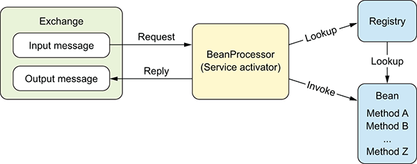

At runtime, a Camel exchange is routed, and at a given point in the route, it reaches the bean component. The bean component (BeanProcessor) then processes the exchange, performing these general steps:

1. Looks up the bean in the registry
2. Selects the method to invoke on the bean
3. Binds to the parameters of the selected method (for example, using the body of the input message as a parameter; this is covered in detail in section 4.5)
4. Invokes the method
5. Handles any invocation errors that occur (any exceptions thrown from the bean will be set on the Camel exchange for further error handling)
6. Sets the method’s reply (if there is one) as the body on the output message on the Camel exchange

Section 4.3 covered how registry lookups are done. The next two steps (steps 2 and 3 in the preceding list) are more complex, and we cover them in the remainder of this chapter. The reason this is more complex in Camel is that Camel has to compute which bean and method to invoke at runtime, whereas Java code is linked at compile time.

### Why does Camel need to select a method?

Why is there more than one possible method name when you invoke a method? The answer is that beans can have overloaded methods, and in some cases the method name isn’t specified either, which means Camel has to pick among all methods on the bean.

Suppose you have the following methods:

    String echo(String s);
    int echo(int number);
    void doSomething(String something);
    
Camel has three methods to choose from. If you explicitly tell Camel to use the echo method, you’re still left with two methods to choose from. We’ll look at how Camel resolves this dilemma.

We’ll first take a look at the algorithm Camel uses to select the method. Then we’ll look at a couple of examples and see what could go wrong and how to avoid problems.

At compile time, you can express your code to invoke the echo method like this:
	
	EchoBean echo = new EchoBean();
	String reply = echo.echo("Camel");
	
This ensures that the echo method is invoked at runtime. On the other hand, suppose you use the EchoBean in Camel in a route as follows:

	from("direct:start")
	  .bean(EchoBean.class, "echo")
	  .to("log:reply");

When the compiler compiles this code, it can’t see that you want to invoke the echo method on the EchoBean. From the compiler’s point of view, EchoBean.class and echo are parameters to the bean method. All the compiler can check is that the EchoBean class exists; if you misspelled the method name, perhaps typing ekko, the compiler couldn’t catch this mistake. The mistake would end up being caught at runtime, when the bean component would throw a MethodNotFoundException stating that the method named ekko doesn’t exist.

Camel also allows you not to explicitly name a method. For example, you could write the previous route as follows:

	from("direct:start")
	  .bean(EchoBean.class)
	  .to("log:reply");

Regardless of whether the method name is explicitly given, Camel has to compute which method to invoke. Let’s look at how Camel chooses.

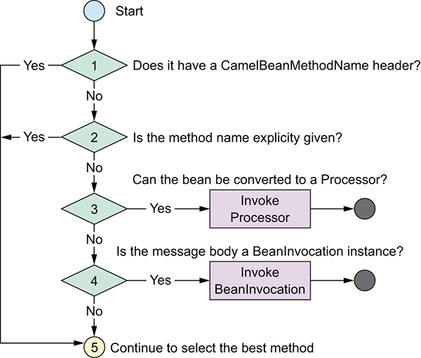

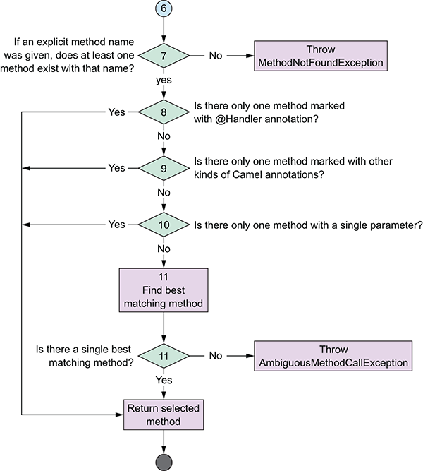

### Potential Method Selection Problems

A few things can go wrong when invoking beans at runtime:

- Specified method not found—If Camel can’t find any method with the specified name, a MethodNotFoundException exception is thrown. This happens only when you’ve explicitly specified the method name.

- Ambiguous method—If Camel can’t single out a method to call, an AmbiguousMethodCallException exception is thrown with a list of the ambiguous methods. This can happen even when an explicit method name is defined, because the method could potentially be overloaded, which means the bean would have multiple methods with the same name; only the number of parameters would vary.

- Type conversion failure—Before Camel invokes the selected method, it must convert the message payload to the parameter type required by the method. If this fails, a NoTypeConversionAvailableException exception is thrown.

Let’s take a look at examples of each of these three situations using the following EchoBean:

	public class EchoBean {
	
	  public String echo(String name) {
	    return name + name;
	  }
	 
	  public String hello(String name) {
	    return "Hello " + name;
	  }
	}
	
1. `MethodNotFoundException` - caused by calling a method that does not exist.

	`.bean("echoBean", "foo")`
	
2. `AmbiguousMethodCallException` - caused by ommiting the method name.

    `.bean("echoBean")`
    
3. The final situation `TypeConversionException` - The message body cannot be converted to th e type required by the method.

Lets say we have:

	public class OrderServiceBean {
	  public String handleXML(Document xml) {
	    ...
	  }
	}
	
And that this is to be used in the route:

	from("jms:queue:orders")
	  .bean("orderService", "handleXML")
	  .to("jms:queue:handledOrders");
	
The handleXML method requires a parameter to be of type org.w3c.dom.Document, which is an XML type, but what if the JMS queue contains a javax.jms.TextMessage not containing any XML data, but just a plain-text message, such as Camel rocks? At runtime, you’ll get the following stack trace:

	org.apache.camel.TypeConversionException: Error during type conversionfrom
	type: java.lang.String to the required type: org.w3c.dom.Documentwith value 
	Camel rocks due org.xml.sax.SAXParseException; lineNumber: 1;columnNumber: 
	1; Content is not allowed in prolog.
	     at org.apache.camel.impl.converter.BaseTypeConverterRegistry.createType
	ConversionException(BaseTypeConverterRegistry.java:571)
	     at org.apache.camel.impl.converter.BaseTypeConverterRegistry.convertTo
	(BaseTypeConverterRegistry.java:129)
	     at org.apache.camel.impl.converter.BaseTypeConverterRegistry.convertTo
	(BaseTypeConverterRegistry.java:100)
	Caused by: org.xml.sax.SAXParseException; lineNumber: 1; columnNumber: 
	1;Content is not allowed in prolog.
	     at com.sun.org.apache.xerces.internal.parsers.DOMParser.parse
	(DOMParser.java:257)
	     at com.sun.org.apache.xerces.internal.jaxp.DocumentBuilderImpl.parse
	(DocumentBuilderImpl.java:348)
	     at org.apache.camel.converter.jaxp.XmlConverter.toDOMDocument
	(XmlConverter.java:902)
	

Camel tries to convert the javax.jms.TextMessage to an org.w3c.dom.Document type, but it fails. In this situation, Camel wraps the error and throws it as a TypeConversionException.

## Method Selection using Type Matching

As hinted at earlier we can also pick our method depending on th etype of prameter it receives - This works automatically using type inferencec bu tcan also be declared explicitly by defining the input type in the route.

	from("jms:queue:orders")
	  .bean("orderService", "handleXML(org.w3c.Document)")
	  .to("jms:queue:handledOrders");

You’d need to specify the class type by using its fully qualified name. But for common types such as Boolean, Integer, and String, you can omit the package name, and use just String as the java.lang.String type:

	from("jms:queue:orders")
	  .bean("orderService", "handleXML(String)")
	  .to("jms:queue:handledOrders");
##Parameter Binding

You’ve already seen parameter binding in action in the many examples so far in this chapter. What those examples have in common is using a single parameter to which Camel bound the input message body. Figure 4.7 illustrates this, using EchoBean as an example.

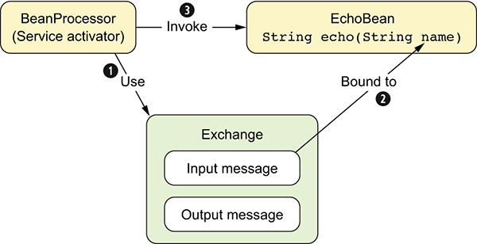

The bean component (BeanProcessor) uses the input message ❶ to bind its body to the first parameter of the method ❷, which happens to be the String name parameter. Camel does this by creating an expression that type-converts the input message body to the String type. This ensures that when Camel invokes the echo method ❸, the parameter matches the expected type.

This is important to understand, because most beans have methods with a single parameter. The first parameter is expected to be the input message body, and Camel will automatically convert the body to the same type as the parameter.

What happens when a method has multiple parameters? That’s what we’ll look at in the remainder of this section.

Working with multiple parameters

Using multiple parameters is more complex than using single parameters. It’s generally a good idea to follow these rules of thumb:

- Use the first parameter for the message body, which may or may not use the @Body annotation.
- Use either a built-in type or add Camel annotations for subsequent parameters.
- When having more than two parameters, consider specifying the binding in the method-name signature, which makes it clear for humans and Camel how each parameter should be mapped. We cover this in section 4.5.5.

In our experience, it becomes complicated when multiple parameters don’t follow these guidelines, but Camel will make its best attempt to adapt the parameters to the method signature.

Camel provides a set of fixed types that are always bound. All you have to do is declare a parameter of one of the types listed in table 4.2.

Suppose you add a second parameter that is one of the built in Types above:

`public string echo(String echo, CamelContext context)`

Or you may invoke 2 extra parameters - Maybe you need the registry to look up some beans:

`public string echo(String echo, CamelContext context, Registry registry)`

Now these will be passed automatically.

So far, you’ve always bound to the message body. But -- How would you bind to a message header? The next section explains that.

## Binding using Camel Annotations

Camel provides a range of annotations to help bind from the exchange to bean parameters. You should use these annotations when you want more control over the bindings. For example, without these annotations, Camel will always try to bind the method body to the first parameter, but with the @Body annotation, you can bind the body to any parameter in the method.

Suppose you have the following bean method:

	public String orderStatus(Integer customerId, Integer orderId)
	
And you have a Camel message that contains the following data:

- Body, with the order ID, as a String type
- Header with the customer ID as an Integer type

With the help of Camel annotations, you can bind the exchange to the method signature as follows:

	public String orderStatus(@Header("customerId") Integer customerId,
	                                @Body Integer orderId)
	                                
	                                
A full list of binding annotations is given below:

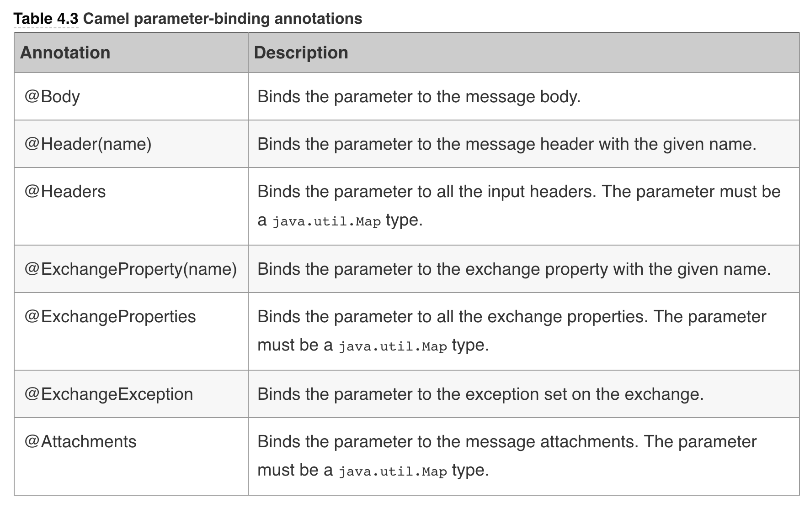

You’ve already seen the first type in action, so let’s try a couple examples with the other annotations. For example, you could use @Header to bind a named header to a parameter, and this can be done more than once, as shown here:

	public String orderStatus(@Body Integer orderId,
	                          @Header("customerId") Integer customerId,
	                          @Header("customerType") Integer customerType) {
	   ...
	}
If we have many headers it may be easier to bind to a Map:

	public String orderStatus(@Body Integer orderId, @Headers Map headers) {
	    Integer customerId = (Integer) headers.get("customerId");
	    String customerType = (String) headers.get("customerType");
	   ...
	}

Finally, let’s look at Camel’s language annotations, which bind parameters to a language.

## Binding using Camel Language Annotations

Lets say we wanted to bind info from an XML message, such as:

	<order customerId="123">
	  <status>in progress</status>
	</order>
	
By using XPath expressions, you can extract parts of ht edocumentand bind them to parameters, like this:

	public void updateStatus(@XPath("/order/@customerId") Integer customerId,
	                               @XPath("/order/status/text()") String status)

You can bind as many parameters as you like—the preceding example binds two parameters by using the @XPath annotations. You can also mix and match annotations, so you can use @XPath for one parameter and @Header for another.

The most commonly used language annotations provided in Camel.

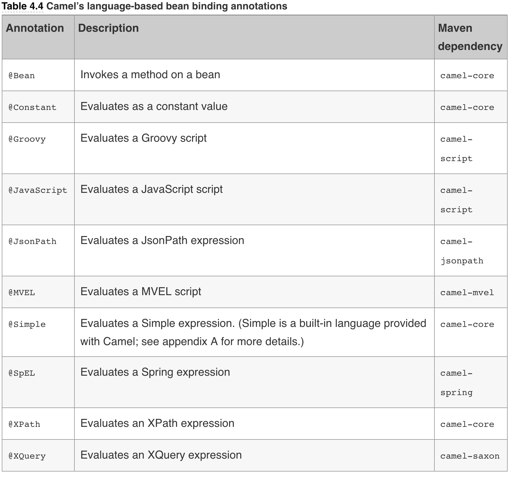

## Adding Correlation ID's using Camel

Lets say we have our IDGenerator:

	public final class GuidGenerator {
	  public static int generate() {
	    Random ran = new Random();
	    return ran.nextInt(10000000);
	  }
	}

And XML configuration of our route.

	<bean id="xmlOrderService" class="camelinaction.XmlOrderService"/>
	
	<camelContext id="camel" xmlns="http://camel.apache.org/schema/spring">
	  <route>
	    <from uri="file://riderautoparts/order/inbox"/>
	    <bean ref="xmlOrderService"/>
	    <to uri="jms:queue:order"/>
	  </route>
	</camelContext>

What’s missing is the step that generates a unique ID and provides that ID in the handleIncomingOrder method (shown in listing 4.8). To do this, you need to declare a bean in the Spring XML file with the ID generator, as follows:

	<bean id="guid" class="camelinaction.GuidGenerator"/>
	

Now we can wire this up with:

	public Document handleIncomingOrder(@Body Document xml,
	                    @XPath("/order/@customerId") int customerId,
	                    @Bean(ref = "guid", method="generate") int orderId);
	                    

Here you can see that the second log line has an orderId attribute with the value of 7303381, whereas the first doesn’t. If you run it again, you’ll see a different order ID because it’s a random value. You can experiment with this example, perhaps changing how the order ID is generated.

### Using @JsonPath binding annotation

To use @JsonPath, you have to include the Camel component, which Maven users can do by adding th efollowing dependency to their pom.xml file:

	<dependency>
	  <groupId>org.apache.camel</groupId>
	  <artifactId>camel-jsonpath</artifactId>
	  <version>2.20.1</version>
	</dependency>

Instead of dealing with incoming orders ax XML - they are now JSON:

	{
	    "order": {
	        "customerId": 4444,
	        "item": "Camel in Action"
	    }
	}
	

The following listing shows how to transform incoming orders in JSON format to a CSV representation ❷ by mapping the customerId and item fields ❶ to bean parameters by using the @JsonPath annotation.

	package camelinaction;
		
	import org.apache.camel.jsonpath.JsonPath;
	import org.apache.camel.language.Bean;
		
	/**
	 * A bean that acts as a JSon order service to handle incoming JSon orders
	 */
	public class JSonOrderService {
		
	    public String handleIncomingOrder(@JsonPath("$.order.customerId") int customerId,
	                                      @JsonPath("$.order.item") String item,
	                                      @Bean(ref = "guid", method = "generate") int orderId) {
		
	        // convert the order to a CSV and inject the generated order id
	        return String.format("%d,%d,%s", orderId, customerId, item);
	    }
		
	}

## Parameter binding using method name with signature

Camel also allows you to specify the parameter-binding information by using a syntax thats similar to calling methods in Java. This requires using the method0name header, including the binding information as the method signature.

#### Pros and cons
This is a powerful technique, as it completely decouples Camel from your Java bean. Your Java bean can stay as is without having to import any Camel code or dependencies at compile time nor runtime. The caveat is that the binding must be defined in a String value that prevents any compile-time checking. In addition, the binding information in the String is limited to what the Simple language provides. For example, the @JsonPath language annotation covered in the previous section isn’t available in the Simple language.

An Example:

Lets say we ahve:

	
	public String orderStatus(@Body Integer orderId,
	                          @Header("customerId") Integer customerId,
	                          @Header("customerType") Integer customerType) {
	  ...
	}
	
Instead of using Camel annotations,

	public String orderStatus(Integer orderId,
	                          Integer customerId,
	                          Integer customerType) {
	  ...
	}

Now the method is clean and has no Camel annotations, and the code has no Camel dependencies. The code can compile without having Camel JARs on the classpath. What you have to do is to specify the binding details in the Camel route instead:

	
	from("direct:start")
	  .bean("orderService",
	    "orderStatus(${body}, ${header.customerId}, ${header.customerType}");

What happened? If you take a closer look, you’ll see that the method-name parameter almost resembles Java source code, as if calling a method with three parameters. If you were to write some Java code and use the Camel Exchange API to call the method from Java, the source code would be something like this:

	OrderStatus bean = ...
	Message msg = exchange.getIn();
	String status = bean.orderStatus(msg.getBody(), msg.getHeader("customerId",
	                                 msg.getHeader("customerType"));
	                                 
This is using raw Java and therefore is bound at compile time - The previous method uses the Simple Language and therefore is bound at startup.

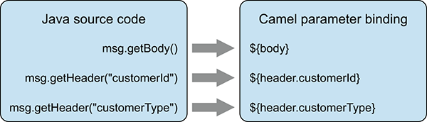

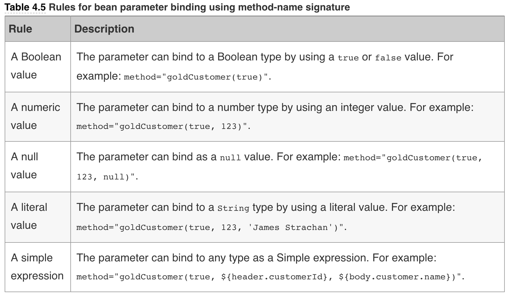

A value that can’t apply to any of the preceding rules would cause Camel to throw an exception at runtime, stating a parameter-binding error.

###### Bean-binding summary

Camel’s rules for bean parameter binding can be summarized as follows:

- All parameters having a Camel annotation will be bound (tables 4.3 and 4.4).
- All parameters of a Camel built-in type will be bound (table 4.2).
- The first parameter is assumed to be the message in body (if not already bound).
- If a method name was given containing parameter-binding details, those will be used (table 4.5).
- All remaining parameters will be unbound, and Camel will pass in empty values.

You’ve seen all there is to bean binding. Camel has a flexible mechanism that adapts to your existing beans, and when you have multiple parameters, Camel provides annotations to bind the parameters properly.

Camel makes it easy to call Java beans from your routes, allowing you to invoke your business logic, or as you saw in chapter 3, to perform message translation using Java code. On top of that, Camel also makes it easy to use beans as decision makers during routing.

## Chapter 4 - Summary and Best Practices

We’ve now covered another cornerstone of using beans with Camel. It’s important that end users of Camel can use the POJO programming model and have Camel easily use those beans (POJOs). Beans are just Java code, which is a language you’re likely to feel comfortable using. If you hit a problem that you can’t work around or figure out how to resolve using Camel and EIPs, you can always resort to using a bean and letting Camel invoke it.

We unlocked the algorithm used by Camel to select which method to invoke on a bean. You learned why this is needed: Camel must resolve method selection at runtime, whereas regular Java code can link method invocations at compile time.

We also covered what bean parameter binding is and how to bind a Camel exchange to any bean method and its parameters. You learned how to use annotations to provide fine-grained control over the bindings, and even how Camel can help bind XPath or JsonPath expressions to parameters, which is a great feature when working with XML or JSON messages.

Let’s pull out some of the key practices you should take away from this chapter:

- Use beans—Beans are Java code, and they give you all the horsepower of Java.

- Use loose coupling—Prefer using beans that don’t have a strong dependency on the Camel API. 
Camel is capable of adapting to existing bean-method signatures, so you can use any existing API you may have, even if it has no dependency on the Camel API. Unit testing is also easier because your beans don’t depend on any Camel API. You can even have developers with no Camel experience develop the beans, and then have developers with Camel experience use those beans.

- Use method facades—If calling your existing beans in a loosely coupled fashion seems too difficult, or you have to specify too many bean parameter mappings or want to avoid introducing Camel annotations on your existing bean, you can use method facades. You can create a new bean as a facade, and use Java code to implement the mapping between Camel and your existing bean.

- Prefer simple method signatures—Camel bean binding is much simpler when method signatures have as few parameters as possible.
Specify method names—Tell Camel which method you intend to invoke, so Camel doesn’t have to figure it out. You can also use @Handler in the bean to tell Camel which method it should pick and use.

- Favor parameter binding using method-signature syntax—When calling methods on POJOs from Camel routes, it’s often easier to specify the parameter binding in the method-name signature in the route that closely resembles Java code. This makes it easier for other users of Camel to understand the code.

- Use the powers of Java as predicates or expressions—When you need to define predicates or expressions when using a more powerful language, consider using plain-old Java code to implement this logic. The Java code can be loosely coupled from Camel and allows for easier unit testing the code, isolated from Camel.

We’ve now covered three crucial features of integration kits: routing, transformations, and using beans. In chapter 2, you were exposed to some of Camel’s routing capabilities by using standard EIPs. In the next chapter, you’ll look at some of the more complex EIPs available in Camel.

## Chapter 12 - Error Handling

### Error Handlers

#### Default
The default error handler is configured with these settings:

- No redelivery occurs.
- Exceptions are propagated back to the caller.
- The stack trace of the exception is printed to the log.
- The routing history of the exchange is printed to the log.
- These settings match what happens when you’re working with exceptions in Java, so Camel’s behavior won’t surprise Camel end users.

#### DeadLetterChannel
The DeadLetterChannel error handler is similar to the default error handler except for the following differences:

- The dead letter channel is the only error handler that supports moving failed messages to a dedicated error queue, known as the dead letter queue.
- Unlike the default error handler, the dead letter channel will, by default, handle exceptions and move the failed messages to the dead letter queue.
- The dead letter channel is by default configured to not log any activity when it handles exceptions.
- The dead letter channel supports using the original input message when a message is moved to the dead letter queue.

To use th DLQ:

  	errorHandler(deadLetterChannel("log:dead?level=ERROR"));

When using the DLQ we can have issues with re-processing the meassage if the mesasge has been transformed by the processing pipeline:

if we have endpoints:

				 A -> B -> C -> D
				 
and the message is transformed by B but fails at C, then we can not retry the failed message from A as it has been transformed and will be somhow different. To mitigate this and to use the original un-transformed message we can do.

	errorHandler(deadLetterChannel("jms:queue:dead").useOriginalMessage());
	
## Enriching messages with the cause of the error

	public class FailureProcessor implements Processor {
	  public void process(Exchange exchange) throws Exception {
	    Exception e = exchange.getProperty(Exchange.EXCEPTION_CAUGHT,Exception.class);
	    String failure = "The message failed because " + e.getMessage();
	    exchange.getIn().setHeader("FailureMessage", failure);
	  }
	}
	
	errorHandler(deadLetterChannel("jms:queue:dead")
	  .useOriginalMessage().onPrepareFailure(new FailureProcessor());