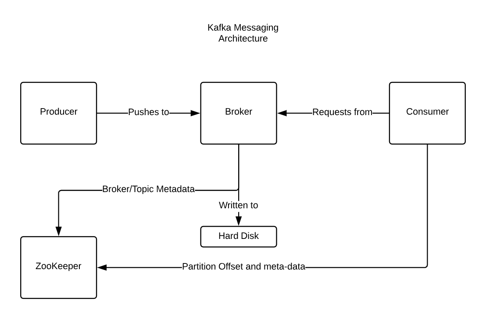

## Kafka

### Terminology

- MESSAGE - A unti of data - analagous to an SQL row.
- KEY - Optional MetaData a key belongs to a message.
- BATCH - A collection of messages all produced to the the same topic and partition.
- BYTE ARRAY - All message to kafka arre just a BYTE ARRAY
- SCHEMA - Consistent data format - JSON, XML, AVRO - Avro is reccomended by confluent for use with Kafka.
- TOPIC - Every Kafka message is written to a topic. this is analagous to a table, consists of a number of partitiions
- PARTITIONS - Time ordering is only gauranteed at the partition level not the topic level. This is the unit of parallelism hence the lack of ordering - A partition can be run on it's own server.
- STREAM - Describes data from a single topic and data moving between a producer/consumer.
- PRODUCER - By defualt sends to topics Round-Robin to partitions of one or more topics
- CONSUMER - Reads messages keeping track of the of the partition.
- BROKER - Sits between Producer and consumer.
- OFFSET - This is the read position of the consumer and is a monotonically increasing integer. This is stored in ZooKeeper.
- CONSUMER GROUP - One or more consuemrs consuming a single topic. Partitions are shared evenly where numerically possible - Having more consumers thatn partitions doesn't make any sense as the consumer will just sit Idle.
- CLUSTER - a group of brokers - has exactly one controller.
- CONTROLLER -
- LEADER - A broker is a leader idf it is the owner of a partition.
- OWNED - A partiton is owned by a single broker.
- MIRROR MAKER - Used for replication between DC's.
- RETENTION - A message retention period defined by a specific time/size.
- ZOOKEEPER - Keeps track of Kafka Meta-Data - This is what makes restarts possible.
- ENSEMBLE - A zookeeper cluster - The word ensemble has a wider meaning - Such that - It is a cluster where the majority of servers must be running for the cluster to be efffective so if we have 7 servers in the original ensemble, 4 must be running for the ensmenbel to be effective. if we only have 3 servers we can only afford to lose one. There must be an odd number of servers in a Zookeeper ensemble.

### How does the key translate to a topic

When using the key to determine which partition to produce to this is calculated by default using  `f(key)mod(# of partitions)` where f is a hashing function. This can be overridden so that a custom patition assignment strategy is used.

### Kafka Simple Architecture

Each Kafka topic is broken down into partitions, which are the basic data building blocks. A partition is stored on a single disk. Kafka guarantees order of events within a partition and a partition can be either online (available) or offline (unavailable). Each partition can have multiple replicas, one of which is a designated leader. All events are produced to and consumed from the leader replica. Other replicas just need to stay in sync with the leader and replicate all the recent events on time. If the leader becomes unavailable, one of the in-sync replicas becomes the new leader.

A replica is considered in-sync if it is the leader for a partition, or if it is a follower that:

Has an active session with Zookeeper—meaning, it sent a heartbeat to Zookeeper in the last 6 seconds (configurable).

Fetched messages from the leader in the last 10 seconds (configurable).

Fetched the most recent messages from the leader in the last 10 seconds. That is, it isn’t enough that the follower is still getting messages from the leader; it must have almost no lag.

OUT-OF-SYNC REPLICAS
Seeing one or more replicas rapidly flip between in-sync and out-of-sync status is a sure sign that something is wrong with the cluster. The cause is often a misconfiguration of Java’s garbage collection on a broker. Misconfigured garbage collection can cause the broker to pause for a few seconds, during which it will lose connectivity to Zookeeper. When a broker loses connectivity to Zookeeper, it is considered out-of-sync with the cluster, which causes the flipping behavior.