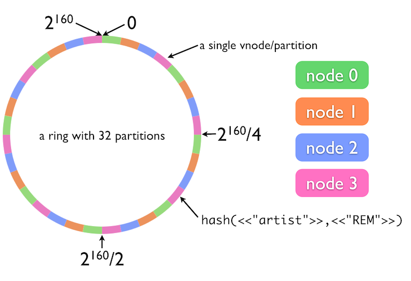
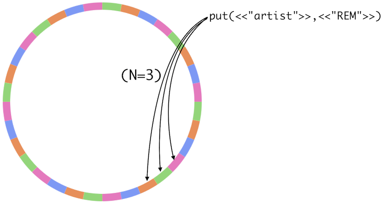

## Riak

All of the information here is taken form the Riak documentation.

[What is Riak](http://docs.basho.com/riak/1.2.0/tutorials/fast-track/What-is-Riak/)

Riak uses a lot of the same ideas as Cassandra. 

- It is truly de-centralised with no concept of Leaders/Master nodes.
- It relies on Consistent Hashing
- It uses Vector Clocks - [Vector Clocks In Riak Explained](http://docs.basho.com/riak/1.2.0/references/appendices/concepts/Vector-Clocks/)
- It uses a ring of "vnodes"

When you add new key/value pairs to a bucket in Riak, each object's bucket and key combination is hashed. The resulting value maps onto a 160-bit integer space. You can think of this integer space as a ring used to figure out what data to put on which physical machines.

lets say:

- Number of Vnodes = 32
- Number of physical nodes = 4
- Replication Factor = 3 (default)

Then each physical node is responsible for 8 Vnodes and each time a write is made to riak it will be made to 3 vnodes. The original node and two nodes that are used for replication.

The below diagram shows this scheme.

When you add machines, data is rebalanced automatically with no downtime. New machines take responsibility for their share of data by assuming ownership of some of the partitions; existing cluster members hand off the relevant partitions and the associated data. The new node continues claiming partitions until data ownership is equal, updating a picture of which nodes own what as it goes. This picture of cluster state is shared to every node using a gossip protocol and serves as a guide to route requests. This is what makes it possible for any node in the cluster to receive requests - developers don't need to deal with the underlying complexity of what data is where.

Riak has systems to provide fualt tolerance too.

#####Hinted Handoff

Hinted handoff lets Riak handle node failure. If a node fails, a neighboring node will take over its storage operations. When the failed node returns, the updates received by the neighboring node are handed back to it. This ensures availability for writes and updates and happens automatically, minimizing the operational burden of failure conditions.

#####Version Conflicts and eventual consistency
In any system that replicates data, conflicts can arise - e.g., if two clients update the same object at the exact same time; or if not all updates have yet reached hardware that is experiencing lag. Further, in Riak, replicas are “eventually consistent”- while data is always available, not all replicas may have the most recent update at the exact same time, causing brief periods (generally on the order of milliseconds) of inconsistency while all state changes are synchronized.

How is divergence addressed? When you make a read request, Riak looks up all replicas for that object. By default, Riak will return the most updated version, determined by looking at the object's vector clock. Vector clocks are metadata attached to each replica when it is created. They are extended each time a replica is updated to keep track of versions. You can also allow clients to resolve conflicts themselves.

[Eventual Consistency](http://docs.basho.com/riak/1.2.0/references/appendices/concepts/Eventual-Consistency/)

#####Read Repair
Further, when an outdated replica is returned as part of a read request, Riak will automatically update the out-of-sync replica to make it consistent. Read repair, a self-healing property of the database, will even update a replica that returns a “not_found” in the event that a node loses it due to physical failure.

#####Reading and Writing Data in Failure Conditions
In Riak, you can set an r value for reads and a w value for writes. These values give you control over how many replicas must respond to a request for it to succeed. Let's say you have an n value of 3, but one of the physical nodes responsible for a replica is down. With r=2, only 2 replicas must return results for a successful read. This allows Riak to provide read availability even when nodes are down or laggy. The same applies for the w in writes. If you don't specify, Riak defaults to quorum: the majority of nodes must respond. There will be more on Tunable CAP Controls in Riak later in the Fast Track.